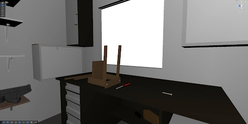
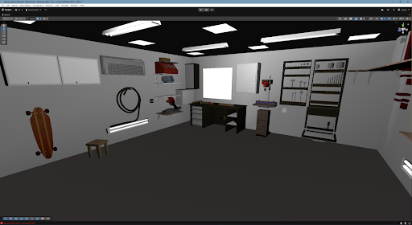
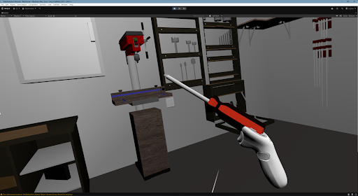
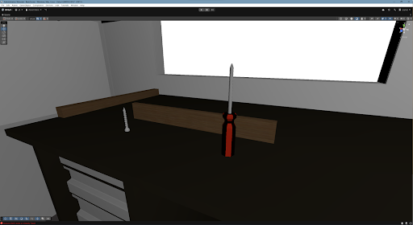

# Warsztat

Prosta gra VR stworzona w Unity. Gracz pracuje w warsztacie i używa narzędzi do łączenia elementów, takich jak deski i śruby.

## Założenie gry

- chwytanie narzędzi i elementów w VR
- wkręcanie śrub
- łączenie desek w większą całość
- interakcja z użyciem systemu XR Interaction Toolkit

## Technologie

- Unity
- C#
- XR Interaction Toolkit
- OpenXR

## Jak uruchomić

1. Otwórz projekt w Unity.
2. Wczytaj scenę `Assets/Scenes/BasicScene.unity`
3. Uruchom projekt w edytorze albo zbuduj wersję na wybraną platformę VR.

## Zrzuty ekranu

## Uwagi

Jeśli chcesz, możesz podmienić powyższe pliki na własne zdjęcia i zmienić nazwy w linkach na odpowiadające im pliki.
